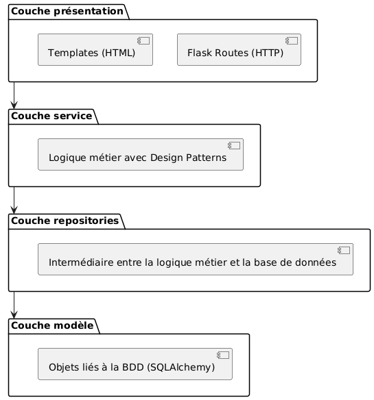
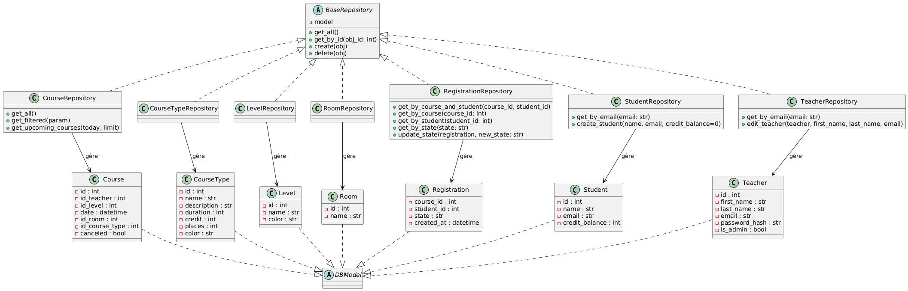
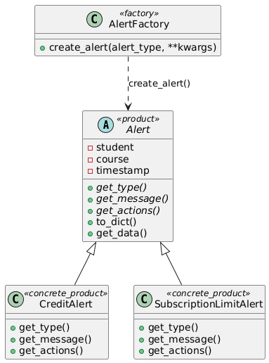
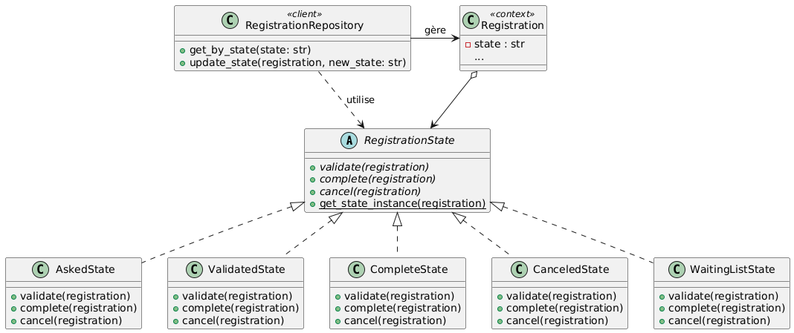
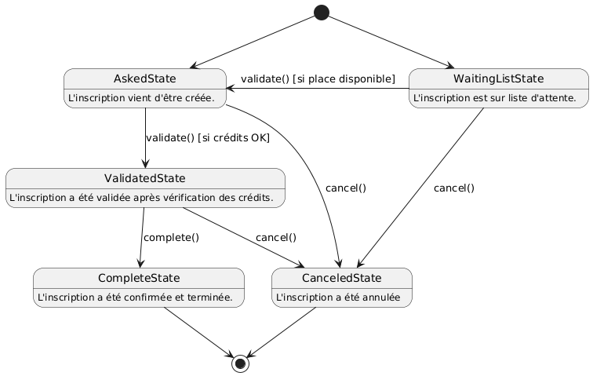
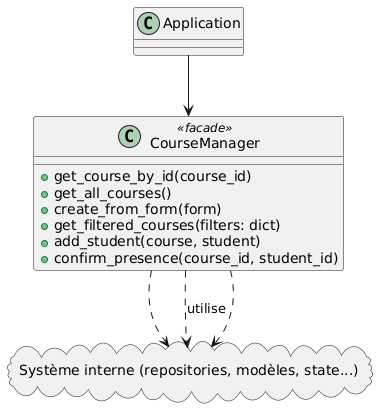
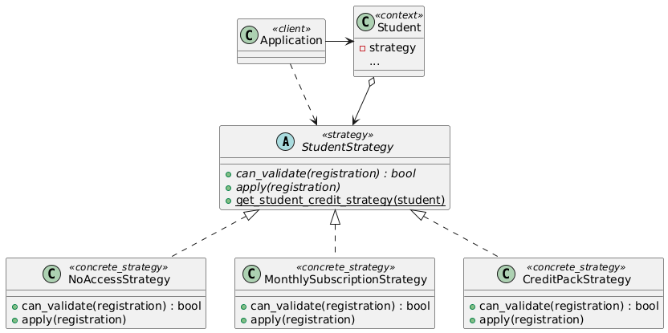
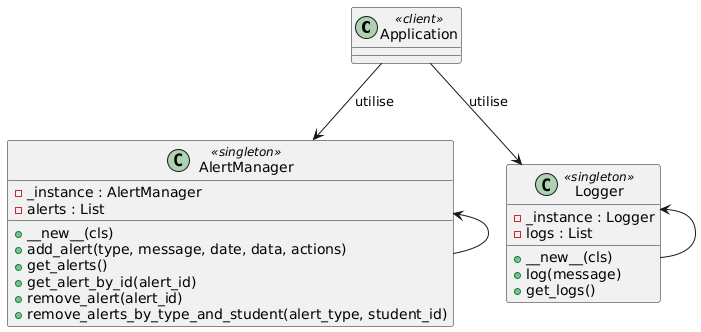

<p>
  
  <span style="font-size: 2em; vertical-align: middle;"><strong>Pole-class-planner</strong></span>
</p>

## Système de gestion de cours de pole dance pour les professeurs

Ce document présente rapidement les choix techniques du projet (langage, outils, architecture) ainsi que les principaux design patterns utilisés, illustrés par des diagrammes UML.

## Sommaire

- [1. Choix techniques](#1-choix-techniques)
- [2. Architecture en couches](#2-architecture-en-couches)
- [3. Design Patterns utilisés](#3-design-patterns-utilisés)
  - [3.1 Pattern Repository](#31-pattern-repository)
  - [3.2 Pattern Factory](#32-pattern-factory)
  - [3.3 Pattern State](#33-pattern-state)
  - [3.4 Pattern Facade](#34-pattern-facade)
  - [3.5 Pattern Strategy](#35-pattern-strategy)
  - [3.6 Pattern Singleton](#36-pattern-singleton)
  - [3.7 Pattern Decorator](#37-pattern-decorator)
- [4. Déploiement et commandes Makefile](#4-déploiement-et-commandes-makefile)
- [5. Couverture de tests](#5-couverture-de-tests)

---

## 1. Choix techniques

- **Langage** : Python
- **Framework** : Flask
- **Base de données** : SQLite (via SQLAlchemy)
- **Tests** : Pytest
- **Versioning** : GitHub (accès au repository fourni)

---

## 2. Architecture en couches

L'application suit une **architecture en couches**, où chaque couche utilise les services de la couche inférieure :



---

## 3. Design Patterns utilisés

Les principaux patterns implémentés sont présentés avec leurs diagrammes UML.

### 3.1 Pattern Repository
Le pattern Repository facilite l'accès aux données en factorisant les opérations sur les modèles.



### 3.2 Pattern Factory
Le pattern Factory centralise la création des objets Alertes selon leur type.



### 3.3 Pattern State
Le pattern State est utilisé pour gérer dynamiquement l'évolution de l'état d'une inscription. Chaque état (`AskedState`, `ValidatedState`, etc.) possède son propre comportement pour les actions `validate()`, `complete()` et `cancel()`, permettant une gestion flexible et claire des transitions.



Diagramme d'états :



### 3.4 Pattern Facade
Le pattern Facade est utilisé pour simplifier l'accès aux opérations sur les cours. Le `CourseManager` regroupe plusieurs actions complexes en une interface unique, masquant l'utilisation directe des repositories et services internes.



### 3.5 Pattern Strategy
Le pattern Strategy est utilisé pour adapter dynamiquement la méthode de validation d'une inscription selon le profil de l'élève. Chaque stratégie (`CreditPackStrategy`, `MonthlySubscriptionStrategy`, `NoAccessStrategy`) encapsule une règle spécifique de validation sans modifier le contexte `Student`.



### 3.6 Pattern Singleton
Le pattern Singleton est utilisé pour garantir une unique instance de `AlertManager` et `Logger` dans toute l'application, assurant ainsi une gestion centralisée des alertes et des logs.



### 3.7 Pattern Decorator
Des décorateurs sont également utilisés pour certaines fonctionnalités comme la restriction d'accès aux routes réservées aux administrateurs (`@admin_required`), mais ils ne constituent pas une implémentation formelle du design pattern "Decorator".
```python
def admin_required(f):
    @wraps(f)
    def decorated_function(*args, **kwargs):
        if not current_user.is_authenticated or not current_user.is_admin:
            abort(403)
        return f(*args, **kwargs)
    return decorated_function
```

## 4. Déploiement et commandes Makefile

Le projet utilise un `Makefile` pour automatiser les étapes de déploiement, d'installation, d'exécution et de tests. Voici un résumé des principales cibles disponibles :

- **all** : Crée l'environnement virtuel puis installe toutes les dépendances nécessaires au projet.
- **venv** : Crée un environnement virtuel Python local dans le dossier `.venv`.
- **install** : Installe toutes les dépendances du projet dans l'environnement virtuel.
- **run** : Lance l'application Flask (`app.py`) en local.
- **test** : Lance l'ensemble des tests (unitaires, intégration, end-to-end).
- **test-unit** : Exécute uniquement les tests unitaires situés dans `tests/unit/`.
- **test-integration** : Exécute uniquement les tests d'intégration situés dans `tests/integration/`.
- **test-e2e** : Exécute uniquement les tests end-to-end situés dans `tests/e2e/`.
- **coverage** : Exécute les tests avec un rapport de couverture de code.
- **clean-venv** : Supprime l'environnement virtuel existant pour le recréer proprement.
- **clean** : Nettoie les fichiers inutiles générés par Python (`__pycache__`, fichiers `.pyc`, `.pyo`, caches de tests...).

## 5. Couverture de tests

Le projet atteint une couverture de tests de **82%**, mesurée avec `pytest-cov`.
